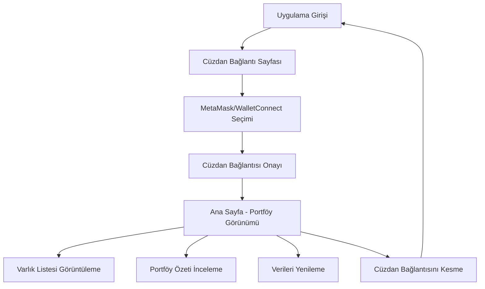

# Web3 Cüzdan Portföy Uygulaması - Ürün Gereksinim Belgesi

## 1. Ürün Genel Bakış

Web3 Cüzdan Portföy Uygulaması, kullanıcıların MetaMask veya WalletConnect üzerinden cüzdanlarını bağlayarak kripto varlıklarını görüntüleyebilecekleri basit ve güvenilir bir platformdur. Uygulama, karmaşık grafikler yerine sade ve modern bir tasarımla kullanıcıların portföy değerlerini kolayca takip etmelerini sağlar.

Hedef kitle: Kripto yatırımcıları ve DeFi kullanıcıları için portföy takip aracı olarak hizmet verir. Zerion'un temiz UI anlayışından ilham alarak güven veren bir deneyim sunar.

## 2. Temel Özellikler

### 2.1 Kullanıcı Rolleri
Bu uygulamada rol ayrımı bulunmamaktadır. Tüm kullanıcılar cüzdan bağlayarak aynı özelliklere erişebilir.

### 2.2 Özellik Modülü

Web3 Cüzdan Portföy uygulaması aşağıdaki ana sayfalardan oluşur:

1. **Ana Sayfa**: Cüzdan bağlama, portföy özeti, varlık listesi
2. **Bağlantı Sayfası**: Cüzdan seçimi ve bağlama işlemleri

### 2.3 Sayfa Detayları

| Sayfa Adı | Modül Adı | Özellik Açıklaması |
|-----------|-----------|-------------------|
| Ana Sayfa | Cüzdan Durumu | Bağlı cüzdan adresini göster, bağlantıyı kes |
| Ana Sayfa | Portföy Özeti | Toplam portföy değeri USD cinsinden, 24 saatlik değişim yüzdesi |
| Ana Sayfa | Varlık Listesi | Token adları, sembolleri, bakiyeler, USD değerleri, fiyat değişimleri |
| Ana Sayfa | Yenileme | Portföy verilerini manuel olarak güncelle |
| Bağlantı Sayfası | Cüzdan Seçimi | MetaMask ve WalletConnect seçenekleri |
| Bağlantı Sayfası | Bağlantı İşlemi | Seçilen cüzdan ile güvenli bağlantı kurma |

## 3. Temel Süreç

**Ana Kullanıcı Akışı:**
1. Kullanıcı uygulamaya girer
2. Cüzdan bağlama sayfasında MetaMask veya WalletConnect seçer
3. Cüzdan bağlantısı onaylanır
4. Ana sayfada portföy özeti ve varlık listesi otomatik yüklenir
5. Kullanıcı varlıklarını görüntüler ve portföy değerini takip eder
6. İsteğe bağlı olarak verileri yeniler veya cüzdan bağlantısını keser

## 4. Kullanıcı Arayüzü Tasarımı

### 4.1 Tasarım Stili

- **Ana Renkler**: Koyu mavi (#1a1b3a), Beyaz (#ffffff), Açık gri (#f8f9fa)
- **Vurgu Renkleri**: Yeşil (#10b981) pozitif değişimler için, Kırmızı (#ef4444) negatif değişimler için
- **Buton Stili**: Yuvarlatılmış köşeli (8px border-radius), gradient efektli
- **Font**: Inter font ailesi, başlıklar için 24px, içerik için 16px, küçük metinler için 14px
- **Layout Stili**: Card tabanlı tasarım, üst navigasyon, merkezi içerik alanı
- **İkon Stili**: Minimalist line iconlar, Heroicons kütüphanesi tercih edilir

### 4.2 Sayfa Tasarım Genel Bakışı

| Sayfa Adı | Modül Adı | UI Elementleri |
|-----------|-----------|----------------|
| Ana Sayfa | Portföy Özeti | Büyük toplam değer kartı, gradient arka plan, 24h değişim badge'i |
| Ana Sayfa | Varlık Listesi | Tablo formatında liste, token logoları, renk kodlu fiyat değişimleri |
| Ana Sayfa | Cüzdan Durumu | Üst bar'da cüzdan adresi (kısaltılmış), disconnect butonu |
| Bağlantı Sayfası | Cüzdan Seçimi | İki büyük kart (MetaMask/WalletConnect), hover efektleri |

### 4.3 Responsive Tasarım

Uygulama desktop-first yaklaşımıyla tasarlanır ancak mobil uyumludur. Tablet ve mobil cihazlarda touch etkileşimi optimize edilir. Minimum genişlik 320px, maksimum içerik genişliği 1200px olarak belirlenir.
